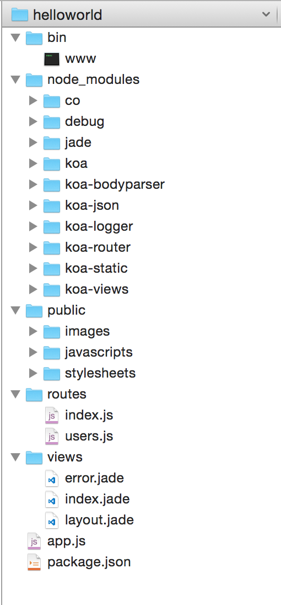

# 以express的方式学习koa

假定你是一个熟悉express的nodejs工程师

- 熟悉nodejs
- 熟悉expressjs
- 想快速学习koa

## 什么是koa？

koa 是由 Express 原班人马打造的，致力于成为一个更小、更富有表现力、更健壮的 Web 框架。使用 koa 编写 web 应用，通过组合不同的 generator，可以免除重复繁琐的回调函数嵌套，并极大地提升错误处理的效率。koa 不在内核方法中绑定任何中间件，它仅仅提供了一个轻量优雅的函数库，使得编写 Web 应用变得得心应手。

http://koajs.com/

更多中间件，上下文，异常处理等，详见[Koa or Express](https://cnodejs.org/topic/55815f28395a0c1812f18257)


## express和koa比较

https://github.com/koajs/koa/blob/master/docs/koa-vs-express.md


| Feature           | Koa | Express | Connect |
|------------------:|-----|---------|---------|
| Middleware Kernel | ✓   | ✓       | ✓       |
| Routing           |     | ✓       |         |
| Templating        |     | ✓       |         |
| Sending Files     |     | ✓       |         |
| JSONP             |     | ✓       |         |


这是一份很久以前的文档，目前来看也是对的，但是koa的生态已经很好了

| Feature           | Koa | Express | Connect |
|------------------:|-----|---------|---------|
| Middleware Kernel | ✓   | ✓       | ✓       |
| Routing           | ✓ koa-router    | ✓       |         |
| Templating        | ✓ koa-views   | ✓       |         |
| Sending Files     | ✓ koa-send   | ✓       |         |
| JSONP             | ✓ koa-safe-jsonp   | ✓       |         |


该有的基本都有了,于是我仿着express-generator写了koa-generator

技术栈如下

- https://github.com/alexmingoia/koa-router
- https://github.com/queckezz/koa-views
- https://github.com/koajs/static
- https://github.com/koajs/logger
- https://github.com/koajs/json
- https://github.com/koajs/body-parsers
- cookies已经koa内置了，无需处理


## 生成器

generator是生成器的意思，用于生成项目骨架，express-generator就是一个比较好的例子，虽然比较精简，但结构清晰，足矣满足一帮性需求

鉴于很多人非常熟悉expressjs，我就假定大家也熟悉express-generator

express-generator提供的功能

- 生成项目骨架
- 约定目录结构（经典，精简，结构清晰）
- 支持css预处理器

express-generator提供的功能

- 生成项目骨架
- 约定目录结构（和express-generator的结构一模一样）
- 支持css预处理器（暂未实行）

2个生成器共同的项目骨架结构

- app.js为入口
- bin/www为启动入口
- 支持static server，即public目录
- 支持routes路由目录
- 支持views视图目录
- 模式jade模板引擎

## 用法

```
npm install -g koa-generator
```

然后使用koa命令创建项目

当前目录创建，如果非空需要加force选项

```
koa
```

创建项目目录

```
koa helloworld
```

实例

```
➜  koatest  koa helloworld

   create : helloworld
   create : helloworld/package.json
   create : helloworld/app.js
   create : helloworld/public
   create : helloworld/public/javascripts
   create : helloworld/public/images
   create : helloworld/public/stylesheets
   create : helloworld/public/stylesheets/style.css
   create : helloworld/routes
   create : helloworld/routes/index.js
   create : helloworld/routes/users.js
   create : helloworld/views
   create : helloworld/views/index.jade
   create : helloworld/views/layout.jade
   create : helloworld/views/error.jade
   create : helloworld/bin
   create : helloworld/bin/www

   install dependencies:
     $ cd helloworld && npm install

   run the app:
     $ DEBUG=helloworld:* npm start
```



```
➜  koatest  cd helloworld 
➜  helloworld  npm install
➜  helloworld  npm start
```

此时访问

- http://127.0.0.1:3000/
- http://127.0.0.1:3000/users

## 路由写法说明

只要是koa-router写的路由都可以加载的，加载方式和express里一样

```
var router = require('koa-router')();

router.get('/', function *(next) {
  this.body = 'this /1!';
});


router.get('2', function *(next) {
  this.body = 'this /2!';
});

module.exports = router;
```

一定要区分

```
url = /2
router.get('2', function *(next) {
  this.body = 'this /2!';
});
```

```
url = //2
router.get('/2', function *(next) {
  this.body = 'this /2!';
});
```

这个是koa-router的一个问题，和express里的路由稍有不一样，注意一些即可

## koa-generator

项目地址 https://github.com/base-n/koa-generator/

分支
  - master是生成器，里面的templates目录放模板
  - tpl是项目模板

欢迎fork、star或issue，O(∩_∩)O谢谢

## 总结

打通了express-generator和koa-generator玄关后，剩下的就是习惯koa的语法，整个世界就更简单了

另外项目骨架的好处是约定技术栈，你可以在上面基础上做更多更有意思的事儿

- [自动挂载路由目录](https://github.com/moajs/mount-koa-routes)
- [koa.res.api返回jsonapi](https://github.com/moajs/koa.res.api)
- [Mount other Koa applications or middleware to a given pathname](https://github.com/koajs/mount)
- [Middleware composition utility](https://github.com/koajs/compose)
- [The ultimate generator based flow-control goodness for nodejs (supports thunks, promises, etc)](https://github.com/tj/co)
- [rest api](https://github.com/zedgu/surface)


提前报个料moajs很快会放出一个基于koa的版本来

全文完

欢迎关注我的公众号【node全栈】

